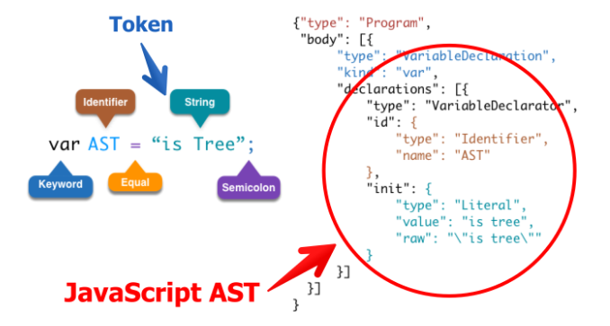

# 运行时、V8、JIT、基线编译器

#### JavaScript 是如何执行的

对于常见编译型语言（例如：Java）来说，编译步骤分为：词法分析->语法分析->语义检查->代码优化和字节生成。
对于解释型语言（例如 JavaScript）来说，通过词法分析 -> 语法分析 -> 语法树，就可以开始解释执行了。



具体过程是这样的：
1. 词法分析是将字符流(char stream)转换为记号流(token stream)
```
NAME "AST"  
EQUALS  
NAME "is Tree"  
SEMICOLON 
```
2. 语法分析成 AST (Abstract Syntax Tree)，你可以在这里试试[http://esprima.org/](http://esprima.org/demo/parse.html#)
3. 预编译，当JavaScript引擎解析脚本时，它会在预编译期对所有声明的变量和函数进行处理！并且是先预声明变量，再预定义函数！
4. 解释执行，在执行过程中，JavaScript 引擎是严格按着作用域机制（scope）来执行的，并且 JavaScript 的变量和函数作用域是在定义时决定的，而不是执行时决定的。JavaScript 中的变量作用域在函数体内有效，无块作用域；
```
function func(){
    for(var i = 0; i < array.length; i++){  
      //do something here.  
    }
    //此时 i 仍然有值，及 i == array.length  
    console.log(i); // 但在 java 语言中，则无效
}
```
JavaScript引擎通过作用域链（scope chain）把多个嵌套的作用域串连在一起，并借助这个链条帮助 JavaScript 解释器检索变量的值。这个作用域链相当于一个索引表，并通过编号来存储它们的嵌套关系。当 JavaScript 解释器检索变量的值，会按着这个索引编号进行快速查找，直到找到全局对象（global object）为止，如果没有找到值，则传递一个特殊的 undefined 值。
```
var scope = "global";
scopeTest();
function scopeTest(){  
    console.log(scope);  
    var scope = "local";  
    console.log(scope); 
}
打印结果：undefined，local；
```

#### JIT
JavaScript 引擎有许多种，我们常说的 V8 是 Google 发布的开源 JavaScript 引擎，采用 C++ 编写。SpiderMonkey 是 Mozilla 项目的一部分，是一个用 C 语言实现的 JavaScript 脚本引擎，另外还有一个叫做 Rhino 的 Java 版本。

因为 Nodejs 依赖于 V8 引擎开发，所以接下来的内容是 JavaScript 在 V8 引擎中的运行状态。


// TODO


> 参考
- [理解 JavaScript 的编译过程与运行机制](http://blog.csdn.net/celte/article/details/39412683)
- [JavaScript的语法解析与抽象语法树](http://www.iteye.com/news/30731)
- [JavaScript 有哪些引擎](http://www.cnblogs.com/gdutbean/archive/2012/02/21/2362003.html)
- [V8 Design Elements](https://my.oschina.net/sub/blog/152628)
- [JavaScript Just-in-time (JIT) 工作原理](http://huziketang.com/blog/posts/detail?postId=58c12f36a6d8a07e449fdd22)
- [JS特性性能缺陷及JIT的解决方案](http://www.cnblogs.com/hyddd/archive/2013/02/06/2908110.html)